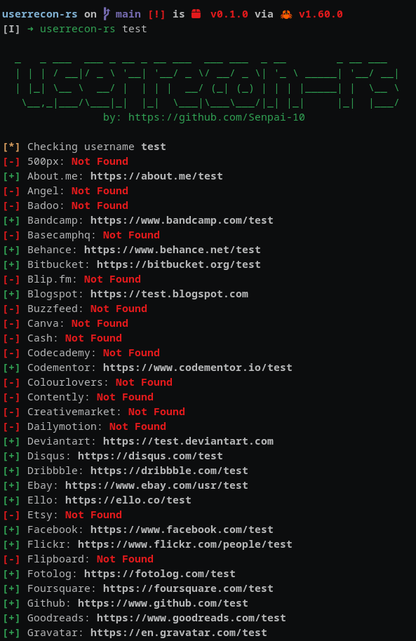

# userrecon-rs

Find usernames across over 72 social networks This is useful if you are running an investigation to determine the usage of the same username on different social networks.

## Table of contents

1. [Install](#install)
2. [Usage](#usage)



## Install

```
cargo install --path .
```

## Usage

```shell
userrecon-rs <username>
```
